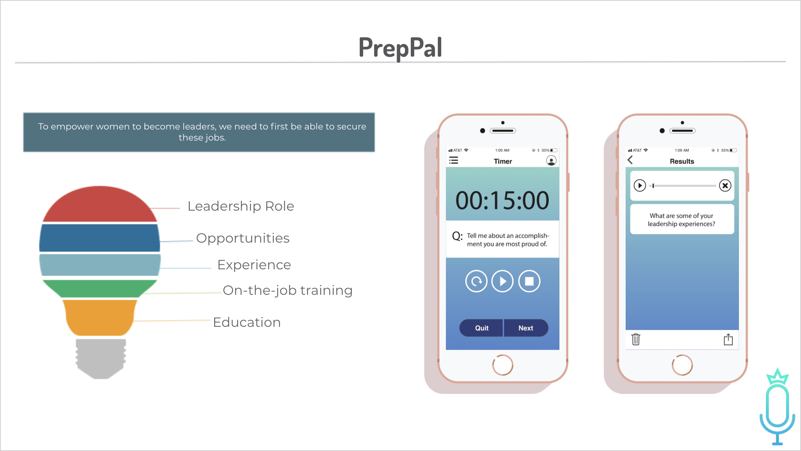
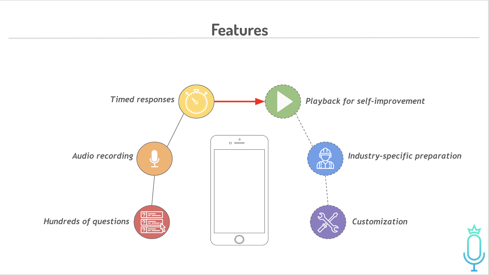

# PrepPal - Android app

Interview practice app - Practice app built on Flutter at Women Who Code Silicon Valley Hackathon 2018. 

App built during a 6 hour session.

**Features:**
(As of April 2019)

- Timed mock interview sessions with pre-populated interview questions.

- Save answers to a database.

- Option to playback to old answers/re-record answers.

